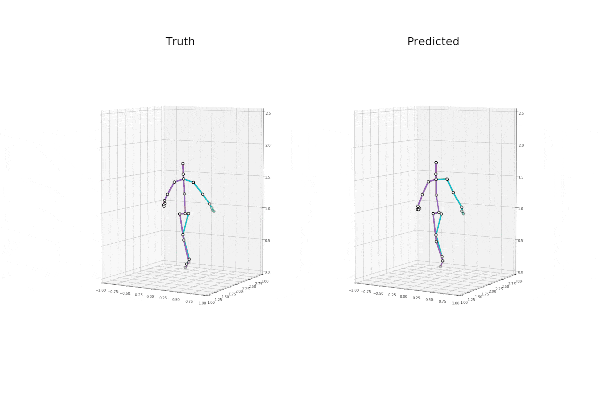
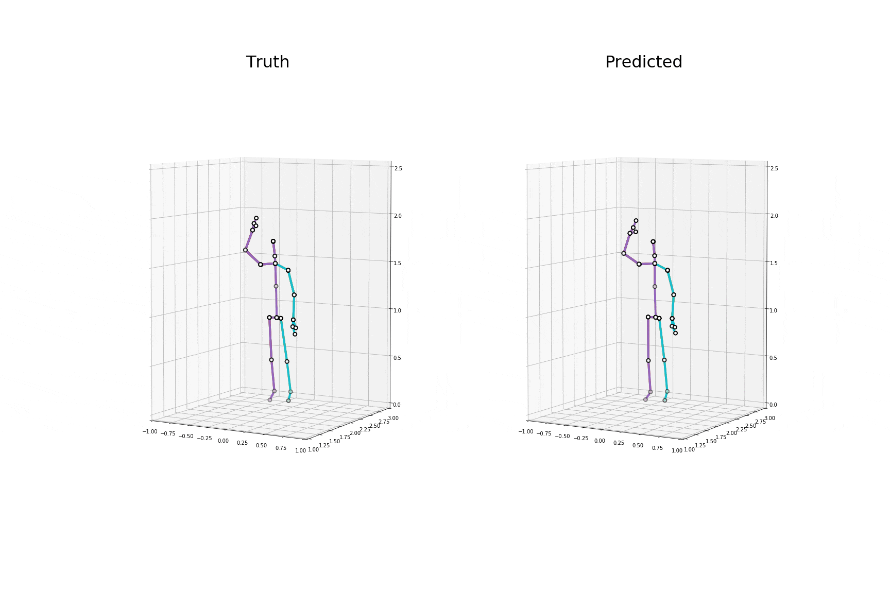
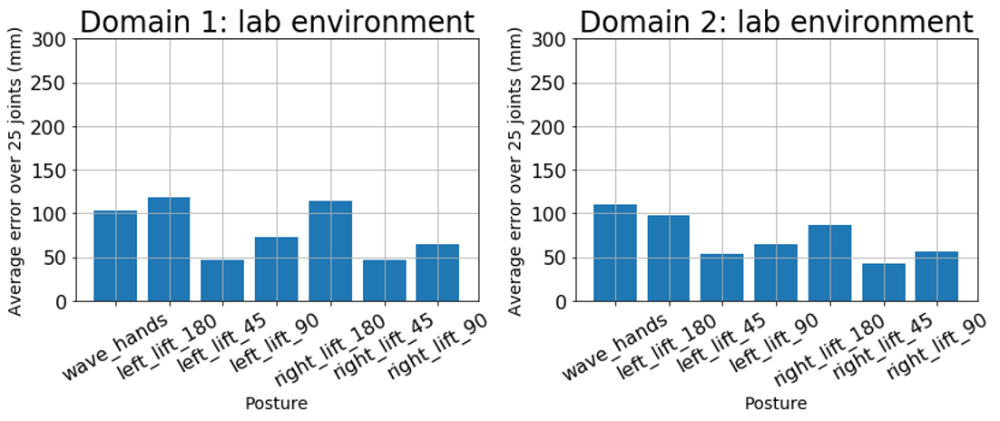
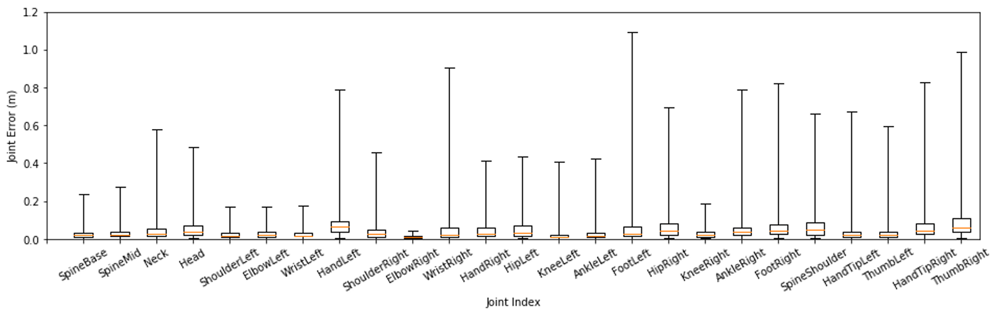

# mPose mmWave Radar Sensing

## Overview

This is the implementation of mmWave radar human 3D posture skeletons sensing and some wheels. Much appreciate to TI, TI e2e forum, [PreSense Radar](https://github.com/PreSenseRadar/OpenRadar) team, [PyKinect2](https://github.com/Kinect/PyKinect2), and [Tensorflow Keras](https://github.com/keras-team/keras) along implementing this project. Please share if you think this repository is helpful.

The repository has following parts.

1. Posture sensing
   - Radar signal processing on raw mmWave radar signal
   - Sync between mmWave radar frames and Kinect skeleton frames
2. Demonstration
3. Wheel codes

## Posture Sensing

The ultimate goal is to reconstruct 3D fullbody human postures using wireless signals. We use directional RF mmWave signal as the signal source, and the camera as the control group. The wireless signal is transmitted from the antenna and bounce back with absorbtion after reaching a barrier. The received signal should imply spatial information that should be able to address with radar signal processing or nerual network. 
<!-- See Figure below for a more intuitive understanding. -->

Advantanges compared with other posture tracking solutions:

- **Privacy-protected.** No camera involved. Privacy informaiton will not be captured by any chance.
- **Realtime.** Have the potential to achieve 60FPS realtime tracking.
- **Easy to setup.** Compact radar antennae.
<!-- - **Environment-independent.**  -->

<!-- [A figure here to show how radar tansmit signal and bounce back after absorbtion.] -->

## A Demonstration of 3D Posture Reconstruction

This section demonstrates the 3D posture reconstruction results comparing with ground truth captured with a depth camera. A model consisted with CNN, RNN, and FCN is trained to reconstruct 3D posture from processed mmWave signal features.

### 3D Posture Animation

### Statistical Results

## Wheels

- Prerequisite
  - Hardware
    - TI AWR1642EVM-ODS mmWave radar
    - TI DCA1000EVM Data capture card
    - Xbox Kinect V2
  - Software
    - [TI mmWave Studio v2.01](https://software-dl.ti.com/ra-processors/esd/MMWAVE-STUDIO/latest/index_FDS.html)
    - [TI mmWave SDK](https://www.ti.com/tool/MMWAVE-SDK)
    - Download [data](https://drive.google.com/file/d/16AnJaEJpsRUfh3Qct37vUvPs4iKCM5G9/view?usp=sharing) and save to `./data/`
    - Python 3.6 environment

- Codes
  - [Capture 3D Skeleton Points from Xbox Kinect.](https://github.com/Lynnes001/mPose_mmWave_sensing/blob/master/docs/capture_kinect.md)
  - [Extract Spatial Heatmaps (azimuth, elevation heatmaps)](https://github.com/Lynnes001/mPose_mmWave_sensing/blob/master/docs/extractRangeAzimuthElevation.md)
  - [Sync Radar Frames with Skeleton Frames from Kinect]

## References

- OpenRadar
- PyKinect2
- Keras
- PreSense Radar