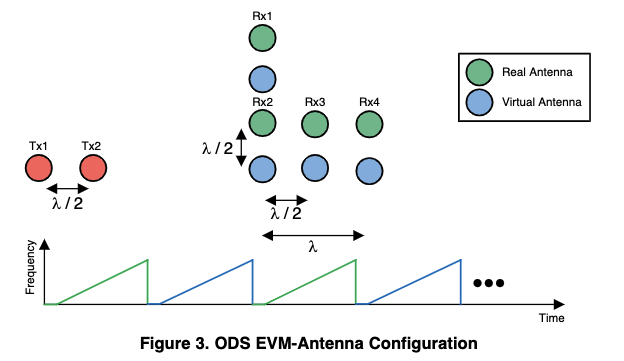

# Extract Spatial Heatmaps


## Prerequisite

AWR1642EVM-ODS + DCA1000 data capture setup. Capture raw mmWave data (adc_data.bin) and save in `./data/data_raw/[posture]/`. You may debug first with my [data](https://drive.google.com/file/d/16AnJaEJpsRUfh3Qct37vUvPs4iKCM5G9/view?usp=sharing).

## Run & Explanation

- Open `./mmWave_py/extractHeatmaps.py` and spicify path to data in `./data/`. 
- Run the first block in `./mmWave_py/extractHeatmaps.py` to extract heatmaps from mmWave frames.

    1. The core function is `featureExtraction` in `utility.py`. This function takes two inputs (data folder, output folder) and outputs heatmapa. 
    
    2. Data is being processed with the following steps.
       
        - Load `.bin` files. Set hardcoded Radar config parameters (see below). The configure is from your settings in mmWave Studio. My config is in `./data/config/mPose0714.xml`.

        ```
        # line 250
        numFrames = 640
        numADCSamples = 512
        numTxAntennas = 2
        numRxAntennas = 4
        numLoopsPerFrame = 76
        numChirpsPerFrame = numTxAntennas * numLoopsPerFrame
        
        BINS_PROCESSED = 55
        ANGLE_RES = 1
        ANGLE_RANGE = 70
        ANGLE_BINS = (ANGLE_RANGE * 2) // ANGLE_RES + 1
        
        dig_out_sample_rate=6000 
        freq_slope_const=39.010
        ```
        - Reorganize radar signals with frames. Get steering vector for further beamforming.
        - Traverse data all frames, separate data to match with virtual antenna setup.
        - For each range bin, conduct beamforming. We get 2 Range-Azimuth and 1 Range-Elevation heatmaps in this step.
        - Prescale heatmap intensity as they are too high. (I do this for further saving them as Float32 without losing trends.)
        - Union 3 heatmaps as one (squarish). Save heatmaps and timestamps. 
        - Write to output path, return.

- Run the second block to visualize a sample of the extracted 3 in 1 heatmaps.


## Q&As

#### Q: Why there are 2 range-azimuth heatmaps but only 1 range-elevation heatmap?

A: You may take a look at virtual antenna theory that TI provided ([MIMO Radar](https://www.ti.com/lit/pdf/swra554])). In AWR1642EVM-ODS, the virtual antenna shows below from [TI Obstacle Detection Reference Design](http://www.ti.com/lit/ug/tidue83/tidue83.pdf). 



*A very misleading point is that that [obstacle detection demo](http://dev.ti.com/tirex/content/mmwave_automotive_toolbox_2_1_2/labs/lab0004_obstacle_detection/docs/obstacle_detection_user_guide.html) in TI's toolbox shows a different figure. TI's staff clarified that the TI Obstacle Detection Reference Design document is correct in a [E2E forum Q&A](https://e2e.ti.com/support/sensors/f/1023/t/902996).


<!-- #### Q: -->


## Other questions, welcome to issues.